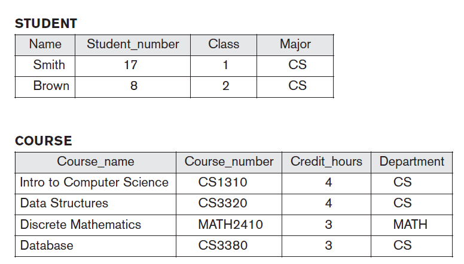
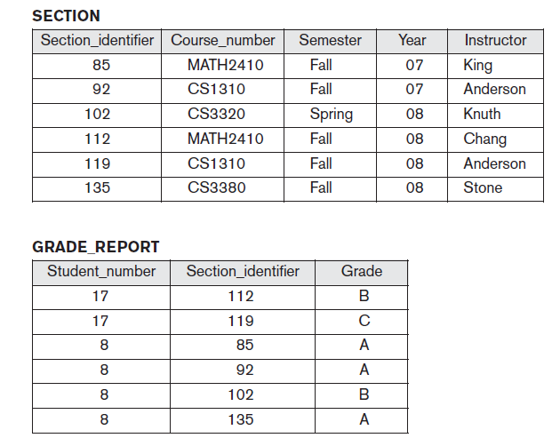
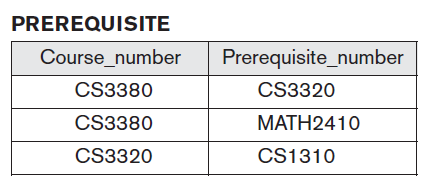

# DBMS-LAB

# [USE THE ORACLE SQL LOGIN](https://www.oracle.com/database/technologies/oracle-live-sql/)

# SQL ETHICS
1. ALL Keywords/Reserved Words must be Capital letters
2. ALL User-Defined Words must be small letters
3. Data Inside the database must be either any case.
4. Data Inside the database must follow business Rules.
   
## List of Experiments
[DBMS LAB_SYLLABUS](DBMS_LAB_SYLLABUS.pdf).

## WEEK1
1. Write SQL queries to CREATE TABLES for various databases using DDL commands (i.e. CREATE, ALTER, DROP, TRUNCATE).
2. Write SQL queries to MANIPULATE TABLES for various databases using DML commands (i.e. INSERT, SELECT, UPDATE, DELETE,).

## Links for Preparations

### DDL COMMANDS

- [CREATE TABLE](https://www.oracletutorial.com/oracle-basics/oracle-create-table/)
- [ALTER TABLE](https://www.oracletutorial.com/oracle-basics/oracle-alter-table/)
- [DROP TABLE](https://www.oracletutorial.com/oracle-basics/oracle-drop-table/)
- [TRUNCATE TABLE](https://www.oracletutorial.com/oracle-basics/oracle-truncate-table/)

### DML COMMANDS

- [INSERT](https://www.oracletutorial.com/oracle-basics/oracle-insert/)
- [SELECT](https://www.oracletutorial.com/oracle-basics/oracle-select/)
- [UPDATE](https://www.oracletutorial.com/oracle-basics/oracle-update/)
- [DELETE](https://www.oracletutorial.com/oracle-basics/oracle-delete/)

# WEEK1: DESIGN THE DATA BASE of the FOLLOWING

## Do the following things for the above data base
1. CREATE TABLES OF THE ABOVE DataBase With Out Constraints [2M]
2. INSERT All Valuses inside the table. [2M]
3. Describe All Tables. [1M]
4. List the Created tables. [1M]
5. Display the Values of each table. [2M]
6. Delete All Tables [2M]
   
## Viva Voce [10 Marks] [Link](https://forms.gle/c6j46VGtdedejy2W9)

# WEEK-1 (COntinuation)
## Constraints for the above Database
1. Primary Key Constraints for the Following Attributes
   1. Student_number for student table
   2. Course_number for course table
   3. Section_idendifier for section table
   4. Student_number, Section_identifier for gradereport table
   5. Course_number, Prerequisite_number for prerequisite table
2. Foriegn Key Constraints for the Following Attributes
   1. Student_number for Grade_report Table
   2. Section_identifier for
   3. Course_number for prerequisite
3. Not Null Constraints for the following Attributes
   1. Major for Student tablethe 
   2. Credit_hrs for Course table
   3. Semester, Section for Section Table
   4. Grade for GradeReport
## Use the above Contraints to implement the following
   1. Implement the tables using above contraints
   2. Display the decription of each table
   3. Insert the values specified by the above database
   4. Display the instances of each table in the database
   5. Delete all tables
## VIVA VOCE [10 Marks] 

