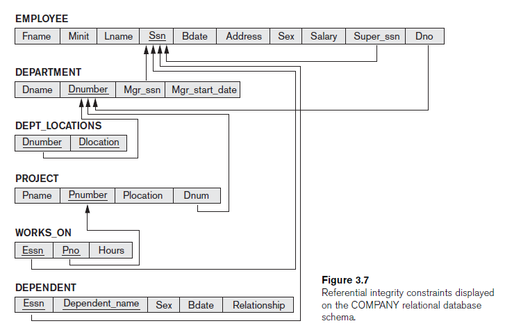
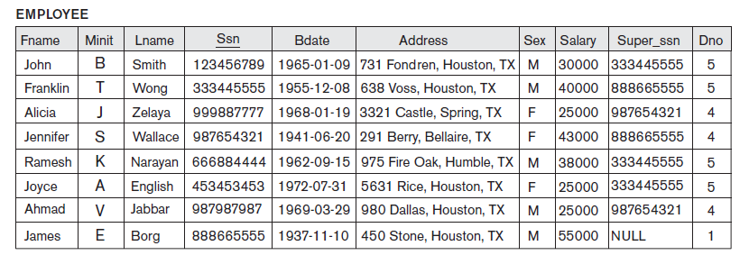
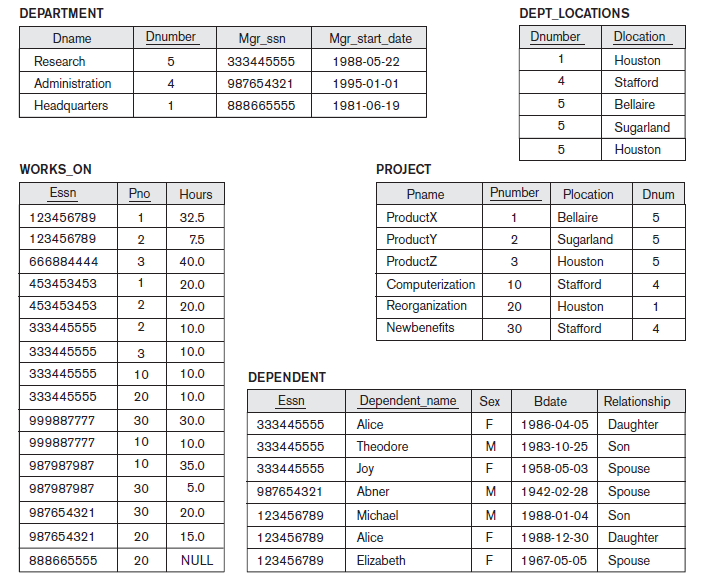
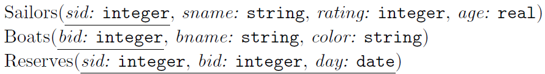
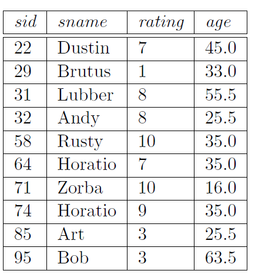
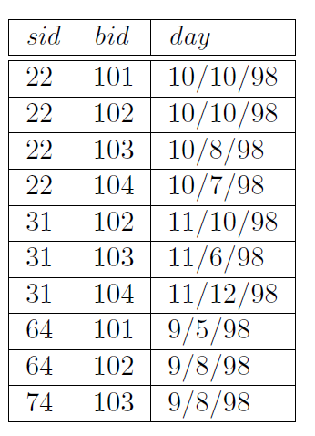
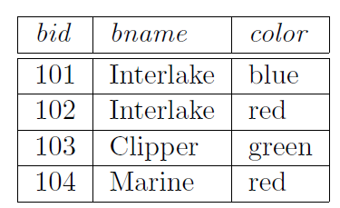

# DBMS-LAB 

## 1. [USE THE ORACLE SQL LOGIN](https://www.oracle.com/database/technologies/oracle-live-sql/)
## 2. [SRIT ORACLE SQL LOGIN SESSION](http://localhost:8080/apex/f?p=4550:1:1238993382107458)

# LIST OF EXPERIMENTS
## 1. [WEEK 1](#WEEK-1)
## 2. [WEEK 2](#WEEK-2)
## 3. [WEEK-3](#WEEK-3)
## 4. [WEEK-4](#WEEK-4)
## 5. [WEEK-5](#WEEK-5)
## 6. [WEEK-6](#WEEK-6)
## 7. [WEEK-7](#WEEK-7)
## 8.  [WEEK-8](#WEEK-8)
## 9. [WEEK-9](#WEEK-9)
## 10. [WEEK-10](#WEEK-10)
## 11. [WEEK-11](#WEEK-11)
## 12. [WEEK-12](#WEEK-12)
## 13. [Additional Experiment-1](#Additional-Experiment-1)
## 14. [Additional Experiment-2](#Additional-Experiment-2)
## 15. [Additional Experiment-3](#Additional-Experiment-3)
## 16. [Additional Experiment-4](#Additional-Experiment-4)
## 17. [Additional Experiment-5](#Additional-Experiment-5)

# SQL ETHICS
1. ALL Keywords/Reserved Words must be Capital letters
2. ALL User-Defined Words must be small letters
3. Data Inside the database must be either any case.
4. Data Inside the database must follow business Rules.
   
## List of Experiments
[DBMS LAB_SYLLABUS](DBMS_LAB_SYLLABUS.pdf).

## [WEEK-1](#DBMS-LAB)
1. Write SQL queries to CREATE TABLES for various databases using DDL commands (i.e. CREATE, ALTER, DROP, TRUNCATE).
2. Write SQL queries to MANIPULATE TABLES for various databases using DML commands (i.e. INSERT, SELECT, UPDATE, DELETE,).

## Links for Preparations

### DDL COMMANDS

- [CREATE TABLE](https://www.oracletutorial.com/oracle-basics/oracle-create-table/)
- [ALTER TABLE](https://www.oracletutorial.com/oracle-basics/oracle-alter-table/)
- [DROP TABLE](https://www.oracletutorial.com/oracle-basics/oracle-drop-table/)
- [TRUNCATE TABLE](https://www.oracletutorial.com/oracle-basics/oracle-truncate-table/)

### DML COMMANDS

- [INSERT](https://www.oracletutorial.com/oracle-basics/oracle-insert/)
- [SELECT](https://www.oracletutorial.com/oracle-basics/oracle-select/)
- [UPDATE](https://www.oracletutorial.com/oracle-basics/oracle-update/)
- [DELETE](https://www.oracletutorial.com/oracle-basics/oracle-delete/)

# WEEK1: DESIGN THE DATA BASE of the FOLLOWING {#w1}


## Do the following things for the above data base
1. CREATE TABLES OF THE ABOVE DataBase With Out Constraints [2M]
2. INSERT All Valuses inside the table. [2M]
3. Describe All Tables. [1M]
4. List the Created tables. [1M]
5. Display the Values of each table. [2M]
6. Delete All Tables [2M]
   
## Viva Voce [10 Marks] [Link](https://forms.gle/c6j46VGtdedejy2W9)

# WEEK-1 (COntinuation) 
## Constraints for the above Database
1. Primary Key Constraints for the Following Attributes
   1. Student_number for student table
   2. Course_number for course table
   3. Section_idendifier for section table
   4. Student_number, Section_identifier for gradereport table
   5. Course_number, Prerequisite_number for prerequisite table
2. Foriegn Key Constraints for the Following Attributes
   1. Student_number for Grade_report Table
   2. Section_identifier for Grade_reoprt Table
   3. Course_number for prerequisite
3. Not Null Constraints for the following Attributes
   1. Major for Student table
   2. Credit_hrs for Course table
   3. Semester, Section for Section Table
   4. Grade for GradeReport
## Use the above Contraints to implement the following
   1. Implement the tables using above contraints
   2. Display the decription of each table
   3. Insert the values specified by the above database
   4. Display the instances of each table in the database
   5. All **branch** attribute in **student** table and Describe the table
   6. Copy **Major** attribure values into **branch** attribute and display it
   7. Remove the **Major** attribute in **Student**
   8. Change the name of **Course_number** to **cid** in **course** and describe it
   9. change the value of **credit-hrs** of *database* to *4* in **course**
   10. Put **NOT NULL** CONSTRAINT to column **branch** in student
   11. Replace the **student** table name to **pupil**
   12. Remove the **student** table
   13. Remove the rows of 'Fall' Semester in **section**
   14. Remove the row of 'Data_structure' in **Course**
   15. Remove all rows in all tables using **TRUNCATE** table
   16. Remove **pupil, course and section** table so that it exist in recycle bin
   17. Remove **Grade_Report & Prerequisites** table permanently
## VIVA VOCE [10 Marks] 
### ---------------------------------- END OF WEEK-1 LAB ------------------------------------------------------
***
# [WEEK-2](#DBMS-LAB)
1.   Queries (along with sub-Queries) using ANY, ALL, IN, EXISTS, NOTEXISTS, UNION, INTERSET, Constraints. Example - Select the roll number and name of the student who secured fourth rank in the class.
2. Queries using Aggregate functions (COUNT, SUM, AVG, MAX and MIN), GROUP BY, HAVING and Creation and dropping of Views.

## Links for Preparations
1. [WHERE CLAUSE](https://www.oracletutorial.com/oracle-basics/oracle-where/)
2. [SUBQUERY](https://www.oracletutorial.com/oracle-basics/oracle-subquery/)
3. [Co-Related SubQuery](https://www.oracletutorial.com/oracle-basics/oracle-correlated-subquery/)
4. [EXISTS](https://www.oracletutorial.com/oracle-basics/oracle-exists/)
5. [NOT EXISTS](https://www.oracletutorial.com/oracle-basics/oracle-not-exists/)
6. [ANY](https://www.oracletutorial.com/oracle-basics/oracle-any/)
7. [ALL](https://www.oracletutorial.com/oracle-basics/oracle-all/)
8. [IN](https://www.oracletutorial.com/oracle-basics/oracle-in/)
9. ### CONSTRAINTS
   1. [PRIMARY KEY](https://www.oracletutorial.com/oracle-basics/oracle-primary-key/)
   2. [FOREIGN KEY](https://www.oracletutorial.com/oracle-basics/oracle-foreign-key/)
   3. [UNIQUE](https://www.oracletutorial.com/oracle-basics/oracle-foreign-key/)
   4. [CHECK](https://www.oracletutorial.com/oracle-basics/oracle-check-constraint/)
   5. [NOT NULL](https://www.oracletutorial.com/oracle-basics/oracle-not-null/)
   6. [DEFAULT](https://www.oracletutorial.com/oracle-basics/oracle-default/)
10. ### SET OPERATIONS
    1. [UNION](https://www.oracletutorial.com/oracle-basics/oracle-union/)
    2. [INTERSECT](https://www.oracletutorial.com/oracle-basics/oracle-intersect/)
    3. [MINUS](https://www.oracletutorial.com/oracle-basics/oracle-minus/)
11. ### Aggregate Functions
    1. [Aggregate Functions](https://www.oracletutorial.com/oracle-aggregate-functions/)
    2. [AVERAGE](https://www.oracletutorial.com/oracle-aggregate-functions/oracle-avg/)
    3. [COUNT](https://www.oracletutorial.com/oracle-aggregate-functions/oracle-count/)
    4. [MAX](https://www.oracletutorial.com/oracle-aggregate-functions/oracle-max/)
    5. [MIN](https://www.oracletutorial.com/oracle-aggregate-functions/oracle-min/)
    6. [SUM](https://www.oracletutorial.com/oracle-aggregate-functions/oracle-sum/)
12. ### Grouping rows
    1. [GROUP BY CLAUSE](https://www.oracletutorial.com/oracle-basics/oracle-group-by/)
    2. [HAVING CLAUSE](https://www.oracletutorial.com/oracle-basics/oracle-having/)
13. ### Creating and Dropping Views
    1. [Introduction to views](https://www.oracletutorial.com/oracle-view/)
    2. [Creating Views](https://www.oracletutorial.com/oracle-view/oracle-create-view/)
    3. [Dropping Views](https://www.oracletutorial.com/oracle-view/oracle-drop-view/)

## USE THE FOLLOWING RELATIONAL SCHEMA and its instances Complete Week-2 Lab Session
<!--
### Company Relatinal Schema 

### Company Relational Instances


## Also Implement the Following Sailors Database
-->
### Sailors Database Schema

### Sailors Instances

### Reserves Instances

### Boat Instances

## Use the above database to Answer the following Questions
1. Find the names and ages of all sailors.[^1]
2. Find all sailors with a rating above 7.[^2]
3. Find the names of sailors who have reserved boat number 103 [^3]
4. Find the sids of sailors who have reserved a red boat. [^4]
5. Find the names of sailors who have reserved a red boat. [^5]
6. Find the colors of boats reserved by Lubber. [^6]
7. Find the names of sailors who have reserved at least one boat. [^7]
8. Compute increments for the ratings of persons who have sailed two different boats on the same day. [^8]
9. Find the ages of sailors whose name begins and ends with B and has at least three characters.[^9]
10. Find the names of Sailors who reserved a red boat or a green boat[^10]
11. Find the names of sailors who have reserved both a red and a green boat.[^11]
12. Find the sids of all sailors who have reserved red boats but not green boats.[^12]
13. Find all sids of sailors who have a rating of 10 or have reserved boat 104[^13]
14.  Find the names of sailors who have reserved boat 103[^14]
15. Find the names of sailors who have reserved a red boat[^15]
16.  Find the names of sailors who have reserved boat number 103 [^16]
17.  Find sailors whose rating is better than some sailor called Horatio. [^17]
18. Find sailors whose rating is better than every sailor called Horatio. [^18]
19. Find the sailors with the highest rating. [^19]
20. Find the names of sailors who have reserved both a red and a green boat. [^20]
21. Find the names of sailors who have reserved all boats. [^21]
22. Find the average age of all sailors. [^22]
23. Find the average age of sailors with a rating of 10. [^23]
24. Find the name and age of the oldest sailor. [^24]
25. Count the number of sailors. [^25]
26. Count the number of different sailor names. [^26]
27. Find the names of sailors who are older than the oldest sailor with a rating of 10. [^27]
28. Find the age of the youngest sailor for each rating level. [^28]
29. Find the age of the youngest sailor who is eligible to vote (i.e., is at least 18 years old) for each rating level with at least two such sailors. [^29]
30.  For each red boat, find the number of reservations for this boat.
31.  Find the average age of sailors for each rating level that has at least two sailors.
32.  Find the average age of sailors who are of voting age (i.e., at least 18 years old) for each rating level that has at least two sailors.
33.  Find the average age of sailors who are of voting age (i.e., at least 18 years old) for each rating level that has at least two such sailors.
34.  Find those ratings for which the average age of sailors is the minimum over all ratings.
  
[^1]:Use **DISTINCT** Keyword to eliminate duplicates
[^2]: Use **WHERE CLAUSE** to Answer the Query.
[^3]: use **WHERE CLAUSE** and DO Cartesian Product to Answer the Query and you have to display names of sailors only
[^4]: use **WHERE CLAUSE** and DO Cartesian Product to Answer the Query and you have to display sids only
[^5]: use **WHERE CLAUSE** and do Cartesian product to answer the Query and display names only
[^6]: use **WHERE CLAUSE** and do Cartesian product to answer the Query and display colors of boat reserved by Lubber.
[^7]: use **WHERE CLAUSE** and do Cartesian product to answer the Query and display names of sailors only.
[^8]: Perform *rating+1* operation in SELECT CLAUSE, use **WHERE CLAUSE** and do Cartesian Product to answer the Query and dispaly names,
[^9]: use Pattern matching techiques in **WHERE CLAUSE** to implement it and ages only.
[^10]: Implement the above Query in two ways. First way perform cartesian and use where clause effectively. second way you can implement **UNION** set Operations.
[^11]:Implement the above Query in two ways. First way perform cartesian and use where clause effectively. second way you can implement **INTERSECT** set Operations.
[^12]:Implement the above Query in two ways. First way perform cartesian and use where clause effectively. second way you can implement **MINUS** set Operations.
[^13]: Perform **UNION** Operation
[^14]: Implement it using nested subqueries and use **IN** Operator
[^15]: implement it using multi nested subqueries and use **IN** Operator
[^16]: Implement co-related subquery method using **EXISTS** operator.
[^17]: use **>ANY** operator to solve the above question.
[^18]: use **>ALL** operator to solve the above question.
[^19]: use **>=ALL** Operator to solve the above question.
[^20]: use **IN** and **Nested Query Method** to solve the above query.
[^21]: Use **NOT EXIST**, **MINUS or Not using also** and **Co-related Nested Query** to solve the above query.
[^22]: use **Aggregate AVG Function** to solve the above query.
[^23]: use **Aggregate AVG Function** and **WHERE CLAUSE** to solve the above query.
[^24]: use **Aggregate MAX Function in nested Query** to solve the above query.
[^25]: use **Aggregate COUNT Function** to solve the above query.
[^26]: use **Aggregate COUNT Function and DISTINCT Keyword** to solve the above query.
[^27]: use **Aggregate AVG Function** and **WHERE CLAUSE** to solve the above query. In Addtion to that Solve the above query using **>ALL operator** to sovle the above query.
[^28]: use **GROUP BY and MIN Function** to solve the above Query
[^29]: use **GROUP BY, HAVING and MIN Function** to solve the above Query.
### ---------------------------- END OF WEEK-2 LAB ---------------------------------------------------------
***
# [WEEK-3](#DBMS-LAB) 
1. Queries using Conversion functions (to_char, to_number and to_date), string functions (Concatenation, lpad, rpad, ltrim, rtrim, lower, upper, initcap, length, substr and instr), date functions (Sysdate, next_day, add_months, last_day, months_between, least, greatest, trunc, round, to_char, to_date)
2. Queries uisng creation of views and dropping of views

## Oracle SQL Functions: Conversion, String, and Date

Oracle SQL provides a powerful set of functions to manipulate data types, strings, and dates. This guide provides explanations and multiple examples for key functions.

***

### 1. Conversion Functions

These functions are used to convert data from one data type to another.

#### `TO_CHAR`

This function converts a **number** or a **date** to a **character string**. It is extremely useful for formatting output.

* **Syntax (for Dates):** `TO_CHAR(date, 'format_model')`
* **Example 1: Formatting a Date**

    ```sql
    SELECT TO_CHAR(SYSDATE, 'YYYY-MM-DD HH24:MI:SS') AS "Current Time" FROM DUAL;
    ```
    **Explanation:** This converts the system date (`SYSDATE`) into a formatted string showing the year, month, day, and time in a 24-hour format.

* **Example 2: Formatting a Number**

    ```sql
    SELECT TO_CHAR(1234567.89, '9,999,999.00') AS "Formatted Number" FROM DUAL;
    ```
    **Explanation:** This converts the number to a string with a thousands separator and two decimal places.

#### `TO_NUMBER`

This function converts a **character string** to a **number**.

* **Syntax:** `TO_NUMBER(string)`
* **Example:**

    ```sql
    SELECT TO_NUMBER('100.50') + 50 FROM DUAL;
    ```
    **Explanation:** The string `'100.50'` is converted to a number, allowing it to be used in a mathematical operation. The result is `150.50`.

#### `TO_DATE`

This function converts a **character string** to a **date** value.

* **Syntax:** `TO_DATE(string, 'format_model')`
* **Example:**

    ```sql
    SELECT TO_DATE('05-SEP-2025', 'DD-MON-YYYY') AS "My Date" FROM DUAL;
    ```
    **Explanation:** The string `'05-SEP-2025'` is converted to a date value according to the specified format model.

***

### 2. String Functions

These functions are used for manipulating strings of text.

#### `Concatenation`

Joins two or more strings together. The `||` operator is the standard way to do this in Oracle SQL.

* **Syntax:** `string1 || string2`
* **Example:**

    ```sql
    SELECT 'First Name: ' || 'John' AS "Full Name" FROM DUAL;
    ```
    **Explanation:** This combines the two strings into a single string: `'First Name: John'`.

#### `LPAD` and `RPAD`

* `LPAD` (Left Pad): Pads a string on the left with a specified character to a desired length.
    * **Example:** `SELECT LPAD('abc', 5, '*') AS "Padded String" FROM DUAL;` (Result: `'**abc'`)
* `RPAD` (Right Pad): Pads a string on the right with a specified character to a desired length.
    * **Example:** `SELECT RPAD('abc', 5, '*') AS "Padded String" FROM DUAL;` (Result: `'abc**'`)

#### `LTRIM` and `RTRIM`

* `LTRIM` (Left Trim): Removes leading characters from a string.
    * **Example:** `SELECT LTRIM('  Hello World') AS "Trimmed String" FROM DUAL;` (Result: `'Hello World'`)
* `RTRIM` (Right Trim): Removes trailing characters from a string.
    * **Example:** `SELECT RTRIM('Hello World  ') AS "Trimmed String" FROM DUAL;` (Result: `'Hello World'`)

#### `LOWER`, `UPPER`, and `INITCAP`

* `LOWER`: Converts a string to lowercase.
    * **Example:** `SELECT LOWER('HELLO') FROM DUAL;` (Result: `'hello'`)
* `UPPER`: Converts a string to uppercase.
    * **Example:** `SELECT UPPER('hello') FROM DUAL;` (Result: `'HELLO'`)
* `INITCAP`: Converts the first letter of each word to uppercase and the rest to lowercase.
    * **Example:** `SELECT INITCAP('hello world') FROM DUAL;` (Result: `'Hello World'`)

#### `LENGTH`, `SUBSTR`, and `INSTR`

* `LENGTH`: Returns the number of characters in a string.
    * **Example:** `SELECT LENGTH('database') FROM DUAL;` (Result: `8`)
* `SUBSTR` (Substring): Extracts a substring from a string.
    * **Example:** `SELECT SUBSTR('Oracle', 1, 3) FROM DUAL;` (Result: `'Ora'`)
* `INSTR` (In-string): Returns the starting position of a substring within a string.
    * **Example:** `SELECT INSTR('database', 'base') FROM DUAL;` (Result: `5`)

***

### 3. Date Functions

These functions are used for working with date and time values.

#### `SYSDATE`

Returns the current date and time of the database server.

* **Example:** `SELECT SYSDATE FROM DUAL;`

#### `NEXT_DAY`

Returns the date of the first occurrence of a specified weekday after a given date.

* **Example:**
    ```sql
    SELECT NEXT_DAY('05-SEP-2025', 'SUNDAY') AS "Next Sunday" FROM DUAL;
    ```
    **Explanation:** This will find the date of the first Sunday after September 5, 2025.

#### `ADD_MONTHS`

Adds a specified number of months to a date.

* **Example:**
    ```sql
    SELECT ADD_MONTHS(SYSDATE, 6) AS "Six Months From Now" FROM DUAL;
    ```

#### `LAST_DAY`

Returns the date of the last day of the month for a given date.

* **Example:**
    ```sql
    SELECT LAST_DAY('05-SEP-2025') AS "Last Day of September" FROM DUAL;
    ```

#### `MONTHS_BETWEEN`

Returns the number of months between two dates.

* **Example:**
    ```sql
    SELECT MONTHS_BETWEEN(SYSDATE, '05-MAR-2025') AS "Months Between" FROM DUAL;
    ```

#### `LEAST` and `GREATEST`

* `LEAST`: Returns the earliest date from a list of dates.
    * **Example:** `SELECT LEAST('05-SEP-2025', '01-JAN-2025') FROM DUAL;` (Result: `'01-JAN-2025'`)
* `GREATEST`: Returns the latest date from a list of dates.
    * **Example:** `SELECT GREATEST('05-SEP-2025', '01-JAN-2025') FROM DUAL;` (Result: `'05-SEP-2025'`)

#### `TRUNC` and `ROUND`

* `TRUNC` (Truncate): Truncates a date to the specified unit (e.g., month, year).
    * **Example:** `SELECT TRUNC(SYSDATE, 'MONTH') FROM DUAL;`
    * **Explanation:** This will return the first day of the current month.
* `ROUND`: Rounds a date to the specified unit.
    * **Example:** `SELECT ROUND(SYSDATE, 'YEAR') FROM DUAL;`
    * **Explanation:** This will return January 1st of the nearest year. For example, if it's June, it will round to the current year; if it's July, it will round to the next year.

## ------------------------------- END OF WEEK-3 LAB --------------------------------------------------------
***

## [WEEK-4](#DBMS-LAB) 
1. Write SQL queries to perform JOIN OPERATIONS (i.e. CONDITIONALJOIN, EQUIJOIN, LEFT OUTER JOIN, RIGHT OUTER JOIN, FULL OUTERJOIN).

### Do the following things to carried out the lab
1. Create a dept table having dno, dname as columns.
2. Apply 'Primary Key Constraint' for **dno** and `NOT NULL Constraint` for **dname** to dept table
1. Create a Student table having sid, sname, and did as columns.
2. Apply Primary Key Constraint to **sid**, `NOT NULL` Constraint to **Sname**  and `Foreign Key Constraint` to **did** refers to dept table
3. Insert all department details like cse, me, ce, eee, ece, csm, csd in the dept table.
4. Insert atleast 10 rows in the student table, take values of your own
5. Write a SQL Query to implement NATURAL JOIN between Student and Dept.
6. Write a SQL Query to implement EQUI JOIN between Student and Dept.
7. Write a SQL Query to implement CONDITIONAL JOIN between Student and Dept.
8. Write a SQL Query to implement LEFT OUTER NATURAL JOIN between Student and Dept.
9. Write a SQL Query to implement  RIGHT OUTER NATURAL JOIN between Student and Dept.
10. Write a SQL Query to implement FULL OUTER NATURAL JOIN between Student and Dept.
11. Write a SQL Query to implement LEFT OUTER EQUI JOIN between Student and Dept.
12. Write a SQL Query to implement RIGHT OUTER EQUI JOIN between Student and Dept.
13. Write a SQL Query to implement FULL OUTER EQUI JOIN between Student and Dept.
14. Write a SQL Query to implement LEFT OUTER CONDITIONAL  JOIN between Student and Dept.
15. Write a SQL Query to implement RIGHT OUTER CONDITIONAL  JOIN between Student and Dept.
16. Write a SQL Query to implement FULL OUTER CONDITIONAL  JOIN between Student and Dept.
17. Write a SQL Query to Implement CROSS JOIN between Student and Dept.
18. Try and Practice how to apply these above JOIN OPERATIONS for the Queries Asked in WEEK 2 Experiment (Do not Considered for LAB Obeservation and Record Only for Practicing Purpose)
### ------------------------- END OF WEEK-4 LAB --------------------------------------------------
***
## [WEEK-5](#DBMS-LAB) 
1.  Create a simple PL/SQL program which includes declaration section, executable section and exception –Handling section (Ex. Student marks can be selected from the table and printed for those who secured first class and an exception can be raised if no records were found)
2.  Insert data into student table and use COMMIT, ROLLBACK and SAVEPOINT in PL/SQL block.

### To Implement a Simple PL/SQL Program Do the following things

**STEP-1:** CREATE A STUDENT TABEL AS FOLLOWS  
```
CREATE TABLE Student(
    studentID NUMBER PRIMARY KEY,
    StudentName VARCHAR2(50),
    Marks NUMBER
);
```
**STEP-2:** INSERT the values into student Using Simple PL/SQL block
```
BEGIN
    INSERT INTO student VALUES(501, 'Rajesh', 62);
    INSERT INTO student VALUES(502,'Abhilash',58);
    INSERT INTO student VALUES(503, 'Bhanu', 75);
	INSERT INTO student VALUES(504, 'Raju', 48);
    INSERT INTO student VALUES(505, 'Williams', 61);
END;
```
**STEP-3:** DISPLAY the Values of the table
```
SELECT * FROM student;
```
**STEP-4:** Implement the Following PL/SQL code 
```
DECLARE
-- Declaration Section
v_student_id Student.StudentID%TYPE;
v_student_name Student.StudentName%TYPE;
v_marks Student.Marks%TYPE;
v_count NUMBER := 0; -- Variable to track if records are found
-- Exception for no records found
e_no_records_found EXCEPTION;
BEGIN
-- Executable Section
DBMS_OUTPUT.PUT_LINE('Students who secured first class (marks >= 60):');
FOR student_rec IN (SELECT StudentID, StudentName, Marks
FROM Student
WHERE Marks >= 60)
LOOP
v_count := v_count + 1; -- Increment counter when records are found
-- Print student details
DBMS_OUTPUT.PUT_LINE('Student ID: ' || student_rec.StudentID ||', Name: ' || student_rec.StudentName ||
', Marks: ' || student_rec.Marks);
END LOOP;
-- If no records found, raise the exception
IF v_count = 0 THEN
RAISE e_no_records_found;
END IF;
EXCEPTION
-- Exception Handling Section
WHEN e_no_records_found THEN
DBMS_OUTPUT.PUT_LINE('No records found for students with first class marks.');
WHEN OTHERS THEN
DBMS_OUTPUT.PUT_LINE('An unexpected error occurred: ' || SQLERRM);
END;
```
**STEP-5:** Remove student who get marks above 60 and Again execute the PL/SQL COde  

### HOW to Insert data into student table and use COMMIT, ROLLBACK and SAVEPOINT in PL/SQL block. 
### DO the Follwing Activities
**STEP-1:** Implement the Following PL/SQL Code  and Run the Code
```BEGIN
-- Inserting records into the Students table
INSERT INTO Student (StudentID, StudentName, Marks)
VALUES (101, 'John Doe', 75);
-- Save the transaction at this point
SAVEPOINT first_save;
INSERT INTO Student (StudentID, StudentName, Marks)
VALUES (201, 'Jane Smith', 85);
-- Save another point after the second insertion
SAVEPOINT second_save;
INSERT INTO Student (StudentID, StudentName, Marks)
VALUES (301, 'Alice Johnson', 50);
-- Rollback to the second_save point, this will remove the the record for Alice Johnson
ROLLBACK TO second_save;
-- Inserting another record after rollback
INSERT INTO Student (StudentID, StudentName, Marks)
VALUES (401, 'Bob Brown', 65);
-- Commit the transaction to finalize changes
COMMIT;
-- Display a message indicating successful transaction
DBMS_OUTPUT.PUT_LINE('Transaction committed successfully.');
EXCEPTION
-- Exception handling: rollback everything if any error occurs
WHEN OTHERS THEN
DBMS_OUTPUT.PUT_LINE('An error occurred: ' || SQLERRM);
ROLLBACK; 
-- Rollback the entire transaction
ROLLBACK; -- Rollback the entire transaction
END;
```
**STEP-2:** Display the Result Using Select 
```
SELECT * FROM student
```
## ----------- END OF WEEK-5 LAB ---------------------------------------------------------------------
***
## [WEEK-6](#DBMS-LAB) 
1.  Develop a program that includes the features NESTED IF, CASE and CASE expression. The program can be extended using the NULLIF and COALESCE functions.
2.  Program development using WHILE LOOPS, numeric FOR LOOPS, nested loops using ERROR Handling, BUILT –IN Exceptions, USE defined Exceptions, RAISE-APPLICATION ERROR.

### To Implement the above Features like NESTED IF, CASE and CASE expression, NULLIF, and COALESCE functions
### Implement the following Code to complete the Week-6 Exp-1 Activity
```
DECLARE
v_student_name VARCHAR2(50) := 'John Doe';
v_marks
NUMBER := NULL; -- Assuming NULL as initial marks value
v_grade
CHAR(1);
v_previous_marks NUMBER := 85;
v_final_marks NUMBER;
BEGIN
-- Using COALaESCE to provide a default value for NULL marks
v_marks := COALESCE(v_marks, 50);
-- If marks are NULL, assign a default value of 50
-- NESTED IF to determine grade based on marks
IF v_marks >= 90 THEN
v_grade := 'A';
ELSIF v_marks >= 80 THEN
IF v_marks < 90 THEN
v_grade := 'B';
END IF;
ELSIF v_marks >= 70 THEN
v_grade := 'C';
ELSIF v_marks >= 60 THEN
v_grade := 'D';
ELSE
v_grade := 'F'; -- Fail
END IF;
-- CASE statement to handle grades assignment
CASE
WHEN v_grade = 'A' THEN
DBMS_OUTPUT.PUT_LINE('Excellent! Grade A.');
WHEN v_grade = 'B' THEN
DBMS_OUTPUT.PUT_LINE('Very Good! Grade B.');
WHEN v_grade = 'C' THEN
DBMS_OUTPUT.PUT_LINE('Good! Grade C.');
WHEN v_grade = 'D' THEN
DBMS_OUTPUT.PUT_LINE('Fair! Grade D.');
WHEN v_grade = 'F' THEN
DBMS_OUTPUT.PUT_LINE('Needs Improvement. Fail.');
ELSE
DBMS_OUTPUT.PUT_LINE('No grade available.');
END CASE;
-- CASE Expression to determine grade using CASE (alternative to NESTED IF)
v_grade := CASE
WHEN v_marks >= 90 THEN 'A'
WHEN v_marks >= 80 THEN 'B'
WHEN v_marks >= 70 THEN 'C'
WHEN v_marks >= 60 THEN 'D'
ELSE 'F'
END;
-- Output based on CASE expression
DBMS_OUTPUT.PUT_LINE('Student ' || v_student_name || ' scored ' || v_marks || ' and
received Grade: ' || v_grade);
-- Using NULLIF to set v_final_marks to NULL if previous marks and current marks are the same
v_final_marks := NULLIF(v_marks, v_previous_marks);
-- If v_marks = v_previous_marks, result will be NULL
-- Output based on NULLIF result
IF v_final_marks IS NULL THEN
DBMS_OUTPUT.PUT_LINE('Marks have not changed.');
ELSE
DBMS_OUTPUT.PUT_LINE('Final marks: ' || v_final_marks);
END IF;
EXCEPTION
-- Exception handling
WHEN OTHERS THEN
DBMS_OUTPUT.PUT_LINE('An unexpected error occurred: ' || SQLERRM);
END;
```
### Exp-2 in Week-6
-- Need to update
#### Use the following code to do EXP-2 in WEEK-6
```plsql
DECLARE
    -- Variables for factorial calculation
    num        NUMBER := 5;
    factorial  NUMBER := 1;
    i          NUMBER := 1;

    -- Custom Exception
    ex_negative_input EXCEPTION;

BEGIN
    DBMS_OUTPUT.PUT_LINE('--- Multiplication Tables from 1 to 5 ---');

    -- Using nested FOR loops
    FOR t IN 1 .. 5 LOOP
        DBMS_OUTPUT.PUT_LINE('Table of ' || t);
        FOR m IN 1 .. 10 LOOP
            DBMS_OUTPUT.PUT_LINE(t || ' x ' || m || ' = ' || (t * m));
        END LOOP;
        DBMS_OUTPUT.PUT_LINE('-----------------------------');
    END LOOP;

    -- User-defined exception for negative input
    IF num < 0 THEN
        RAISE ex_negative_input;
    END IF;

    -- WHILE loop to calculate factorial
    WHILE i <= num LOOP
        factorial := factorial * i;
        i := i + 1;
    END LOOP;

    DBMS_OUTPUT.PUT_LINE('Factorial of ' || num || ' is: ' || factorial);

    -- Example of built-in exception (ZERO_DIVIDE)
    DECLARE
        x NUMBER := 10;
        y NUMBER := 0;
        z NUMBER;
    BEGIN
        z := x / y; -- will cause ZERO_DIVIDE exception
        DBMS_OUTPUT.PUT_LINE('Division Result: ' || z);
    EXCEPTION
        WHEN ZERO_DIVIDE THEN
            DBMS_OUTPUT.PUT_LINE('Error: Division by zero is not allowed.');
    END;

EXCEPTION
    WHEN ex_negative_input THEN
        RAISE_APPLICATION_ERROR(-20001, 'Negative number entered for factorial. Not allowed.');

    WHEN OTHERS THEN
        DBMS_OUTPUT.PUT_LINE('Unexpected Error: ' || SQLERRM);

END;
```
## ------------------------------------------------ END of WEEK-6 ----------------------------------------
***


## [WEEK-7](#DBMS-LAB) 
1. Programs development using creation of procedures, passing parameters IN and OUT of PROCEDURES
2. Program development using creation of stored functions, invoke functions in SQL Statements and write complex functions.
## To Implement Procedure by Passing IN and OUT parameters Do the following activities.
1. Create a Procedure to calculate total marks, average marks and Grade of a students
2. Run the above Procedure using Anonymous PL/SQL Block
### STEP-1 Creating Student Procedure to evaluate a Student
```plsql
-- Creating the procedure
CREATE OR REPLACE PROCEDURE calc_student_result (
    mark1 IN NUMBER,
    mark2 IN NUMBER,
    mark3 IN NUMBER,
    total OUT NUMBER,
    average OUT NUMBER,
    grade OUT VARCHAR2
) AS
BEGIN
    -- Calculate total and average
    total := mark1 + mark2 + mark3;
    average := total / 3;

    -- Determine grade
    IF average >= 90 THEN
        grade := 'A';
    ELSIF average >= 75 THEN
        grade := 'B';
    ELSIF average >= 60 THEN
        grade := 'C';
    ELSIF average >= 50 THEN
        grade := 'D';
    ELSE
        grade := 'F';
    END IF;
END;
```
### STEP-2: Implement PLSQL anonymous block to execute the Proceudre
```plsql
DECLARE
    t NUMBER;
    avg1 NUMBER;
    g VARCHAR2(3);
BEGIN
    -- Call the procedure with IN values and OUT variables
calc_student_result(85, 78, 92, t, avg1, g);

    -- Display output
    DBMS_OUTPUT.PUT_LINE('Total: ' || t);
    DBMS_OUTPUT.PUT_LINE('Average: ' || avg1);
    DBMS_OUTPUT.PUT_LINE('Grade: ' || g);
END;
```
## ------------------------------------------------- END of WEEK-7 LAB -----------------
## [WEEK-8](#DBMS-LAB) 
### Develop programs using features parameters in a CURSOR, FOR UPDATE CURSOR, WHERE CURRENT of clause and CURSOR variables.
### The Following Steps is carried out to immpement the following:
### STEP-1: Create EMP Table (Similar to Oracle’s default EMP table)
```sql
CREATE TABLE emp (
    empno    NUMBER(4) PRIMARY KEY,
    ename    VARCHAR2(10),
    job      VARCHAR2(9),
    mgr      NUMBER(4),
    hiredate DATE,
    sal      NUMBER(7,2),
    comm     NUMBER(7,2),
    deptno   NUMBER(2)
);
```
### STEP-2: Insert Sample Data into EMP Using PL/SQL CODE
```
BEGIN
INSERT INTO emp VALUES (7369, 'SMITH',  'CLERK',     7902, TO_DATE('17-DEC-1980','DD-MON-YYYY'), 800,  NULL, 20);
INSERT INTO emp VALUES (7499, 'ALLEN',  'SALESMAN',  7698, TO_DATE('20-FEB-1981','DD-MON-YYYY'), 1600, 300,  30);
INSERT INTO emp VALUES (7521, 'WARD',   'SALESMAN',  7698, TO_DATE('22-FEB-1981','DD-MON-YYYY'), 1250, 500,  30);
INSERT INTO emp VALUES (7566, 'JONES',  'MANAGER',   7839, TO_DATE('02-APR-1981','DD-MON-YYYY'), 2975, NULL, 20);
INSERT INTO emp VALUES (7698, 'BLAKE',  'MANAGER',   7839, TO_DATE('01-MAY-1981','DD-MON-YYYY'), 2850, NULL, 30);
INSERT INTO emp VALUES (7782, 'CLARK',  'MANAGER',   7839, TO_DATE('09-JUN-1981','DD-MON-YYYY'), 2450, NULL, 10);
INSERT INTO emp VALUES (7788, 'SCOTT',  'ANALYST',   7566, TO_DATE('19-APR-1987','DD-MON-YYYY'), 3000, NULL, 20);
INSERT INTO emp VALUES (7839, 'KING',   'PRESIDENT', NULL, TO_DATE('17-NOV-1981','DD-MON-YYYY'), 5000, NULL, 10);
INSERT INTO emp VALUES (7844, 'TURNER', 'SALESMAN',  7698, TO_DATE('08-SEP-1981','DD-MON-YYYY'), 1500,   0, 30);
INSERT INTO emp VALUES (7900, 'JAMES',  'CLERK',     7698, TO_DATE('03-DEC-1981','DD-MON-YYYY'), 950,  NULL, 30);
INSERT INTO emp VALUES (7902, 'FORD',   'ANALYST',   7566, TO_DATE('03-DEC-1981','DD-MON-YYYY'), 3000, NULL, 20);
INSERT INTO emp VALUES (7934, 'MILLER', 'CLERK',     7782, TO_DATE('23-JAN-1982','DD-MON-YYYY'), 1300, NULL, 10);
COMMIT;
END;
```
### STEP-3:  CREATE Cursor with Parameters 
```plsql
DECLARE
    CURSOR emp_cursor(p_deptno NUMBER) IS
        SELECT empno, ename, sal FROM emp WHERE deptno = p_deptno;

    v_empno emp.empno%TYPE;
    v_ename emp.ename%TYPE;
    v_sal   emp.sal%TYPE;
BEGIN
    DBMS_OUTPUT.PUT_LINE('--- Employees in Dept 10 ---');
    FOR emp_rec IN emp_cursor(10) LOOP
        DBMS_OUTPUT.PUT_LINE('Emp No: ' || emp_rec.empno || ', Name: ' || emp_rec.ename || ', Salary: ' || emp_rec.sal);
    END LOOP;
END;
```
### STEP-4: FOR UPDATE Cursor with WHERE CURRENT OF (It Means Create a Cursor to do Update Activity)
```plsql
DECLARE
    CURSOR cur_emp IS
        SELECT empno, sal FROM emp WHERE deptno = 20 FOR UPDATE;

    v_new_sal emp.sal%TYPE;
BEGIN
    FOR emp_rec IN cur_emp LOOP
        v_new_sal := emp_rec.sal * 1.10;

        UPDATE emp
        SET sal = v_new_sal
        WHERE CURRENT OF cur_emp;
    END LOOP;

    COMMIT;
    DBMS_OUTPUT.PUT_LINE('Salaries updated for employees in dept 20.');
END;
```
### STEP-5: Implement Cursor Variables Using REF CURSOR
```plsql
DECLARE
    TYPE emp_ref_cursor IS REF CURSOR;
    emp_cv emp_ref_cursor;

    v_empno emp.empno%TYPE;
    v_ename emp.ename%TYPE;
    v_sal   emp.sal%TYPE;
BEGIN
    OPEN emp_cv FOR SELECT empno, ename, sal FROM emp WHERE deptno = 30;

    LOOP
        FETCH emp_cv INTO v_empno, v_ename, v_sal;
        EXIT WHEN emp_cv%NOTFOUND;
        DBMS_OUTPUT.PUT_LINE('Emp No: ' || v_empno || ', Name: ' || v_ename || ', Salary: ' || v_sal);
    END LOOP;

    CLOSE emp_cv;
END;
```
## ------------------------------------ END OF LAB of WEEK-8 ---------------------------------------
***
## [WEEK-9](#DBMS-LAB) 
### Develop Programs using BEFORE and AFTER Triggers, Row and Statement Triggers and INSTEAD OF Triggers.
#### Do the Following Activities to implement the above Program
### STEP-1: Implement the Employee Table and Audit_log Table
```sql
CREATE TABLE employees (
    emp_id   NUMBER PRIMARY KEY,
    emp_name VARCHAR2(100),
    salary   NUMBER
);
```
```sql
CREATE TABLE audit_log (
    log_id     NUMBER GENERATED ALWAYS AS IDENTITY PRIMARY KEY,
    action     VARCHAR2(10),
    emp_id     NUMBER,
    log_time   TIMESTAMP DEFAULT CURRENT_TIMESTAMP
);
```
### STEP-2: Implement Row-level Trigger before Insertion (BEFORE ROW Trigger – Validate Salary Before Insert)
```plsql
CREATE OR REPLACE TRIGGER trg_before_insert_emp
BEFORE INSERT ON employees
FOR EACH ROW
BEGIN
    IF :NEW.salary < 1000 THEN
        RAISE_APPLICATION_ERROR(-20001, 'Salary must be at least 1000');
    END IF;
END;
```
### STEP-3: Adding log information in the audit log table using ROW Trigger After Inserting a Record.
```plsql
CREATE OR REPLACE TRIGGER trg_before_insert_emp
BEFORE INSERT ON employees
FOR EACH ROW
BEGIN
    IF :NEW.salary < 1000 THEN
        RAISE_APPLICATION_ERROR(-20001, 'Salary must be at least 1000');
    END IF;
END;
```
### STEP-4:  STATEMENT-LEVEL Trigger BEFORE INSERT – (Fires Once Before INSERT)
```plsql
CREATE OR REPLACE TRIGGER trg_before_insert_stmt
BEFORE INSERT ON employees
BEGIN
    DBMS_OUTPUT.PUT_LINE('--- BEFORE INSERT STATEMENT Trigger Fired ---');
END;
```
### STEP-5: STATEMENT-LEVEL Trigger AFTER Insert – Fires Once After INSERT
```plsql
CREATE OR REPLACE TRIGGER trg_after_insert_stmt
AFTER INSERT ON employees
BEGIN
    DBMS_OUTPUT.PUT_LINE('>> AFTER INSERT STATEMENT Trigger Fired');
END;
```
### STEP-6: TESTING THE TRIGGERS
```Plsql
BEGIN
-- Enable output (run this only once in SQL*Plus or SQL Developer)
SET SERVEROUTPUT ON;
INSERT INTO employees (emp_id, emp_name, salary)
VALUES (301, 'Alice', 1500);

INSERT INTO employees (emp_id, emp_name, salary)
VALUES (302, 'Bob', 2200);

INSERT INTO employees (emp_id, emp_name, salary)
VALUES (304, 'Carol', 1800);

INSERT INTO employees (emp_id, emp_name, salary)
VALUES (305, 'David', 2600);
SELECT * FROM employees;
SELECT * FROM audit_log;
END;
```
### STEP-7: Implementing Triggers on View Using INSTEAD OF 
#### STEP-7.1: Create View
```sql
CREATE OR REPLACE VIEW emp_view AS
SELECT emp_id, emp_name FROM employees;
```
#### STEP-7.2: INSTEAD OF Trigger for View
```plsql
CREATE OR REPLACE TRIGGER trg_instead_of_insert_emp_view
INSTEAD OF INSERT ON emp_view
FOR EACH ROW
BEGIN
    INSERT INTO employees(emp_id, emp_name, salary)
    VALUES (:NEW.emp_id, :NEW.emp_name, 1000);  -- default salary
END;
```
#### STEP-7.3: Write a PL/SQL block to test the view
```
BEGIN
    -- Insert via the view (should trigger INSTEAD OF INSERT trigger)
    INSERT INTO emp_view (emp_id, emp_name) VALUES (401, 'ViewUser1');
    INSERT INTO emp_view (emp_id, emp_name) VALUES (402, 'ViewUser2');
    
    DBMS_OUTPUT.PUT_LINE('View inserts executed successfully.');
    
    -- Select from base table to confirm insertion
    FOR rec IN (SELECT emp_id, emp_name, salary FROM employees WHERE emp_id IN (401, 402)) LOOP
        DBMS_OUTPUT.PUT_LINE('ID: ' || rec.emp_id || ', Name: ' || rec.emp_name || ', Salary: ' || rec.salary);
    END LOOP;
END;
```
## -----------------------------------------END OF WEEK-9 LAB ---------------------------------
***
## [WEEK-10](#DBMS-LAB) 
### Create a table and perform the search operation on table using indexing and non-indexing techniques
### Step 1: Create the students Table
This table stores student details including course name.  
```
CREATE TABLE students (
    student_id   NUMBER PRIMARY KEY,
    student_name VARCHAR2(100),
    course       VARCHAR2(50),
    phone        VARCHAR2(15)
);
```
## Step 2: Insert Sample Data
We will insert 10,000 student records with random course names for testing.  
```
BEGIN
    FOR i IN 1..10000 LOOP
        INSERT INTO students (student_id, student_name, course, phone)
        VALUES (
            i,
            'Student_' || i,
            CASE MOD(i, 3)
                WHEN 0 THEN 'B.Sc'
                WHEN 1 THEN 'B.Com'
                ELSE 'B.A'
            END,
            '99999' || LPAD(i, 5, '0')
        );
    END LOOP;
    COMMIT;
END;
/
```
## Step 3: Search Without Index (Non-Indexed)  
We will now search for students enrolled in `B.Sc` **without any index.**  
```
EXPLAIN PLAN FOR
SELECT * FROM students WHERE course = 'B.Sc';

```
Then, display the execution plan:
```
SELECT * FROM TABLE(DBMS_XPLAN.DISPLAY);
```
## Step 4: Create an Index on course Column
Now, create an index to speed up the search.  
```
CREATE INDEX idx_course ON students(course);

```
## Step 5: Search With Index (Indexed)
Repeat the same search. This time, Oracle should use the index.  
```
EXPLAIN PLAN FOR
SELECT * FROM students WHERE course = 'B.Sc';
```
Then, re display the execution plan:
```
SELECT * FROM TABLE(DBMS_XPLAN.DISPLAY);
```
## Remove the Indexing
To return to the original state (without index), drop it:
```
DROP INDEX idx_course;
```
## ------------------------------------------------ END OF WEEK-10 LAB ---------------------
***
## [WEEK-11](#DBMS-LAB) 
### A publishing company produces scientific books on various subjects. The books are written by authors who specialize in one particular subject. The company employs editors who, not necessarily being specialists in a particular area, each take sole responsibility for editing one or more publications. A publication covers essentially one of the specialist subjects and is normally written by a single author. When writing a particular book, each author works with on editor, but may submit another work for publication to be supervised by other editors. To improve their competitiveness, the company tries to employ a variety of authors, more than one author being a specialist in a particular subject for the above case study, do thefollowing: 
1. **Analyze the datarequired**
2. **Normalize theattributes.**
Create the logical data model using E-R diagrams

## [WEEK-12](#DBMS-LAB) 
### A new e-commerce startup needs a database to manage its products, customers, orders, and inventory. Hence develop the database with following:
 * **Design the database schema using Entity-Relationship (ER) diagrams.**
 * **Create the database and tables using SQL.**
 * **Insert sample data into the tables.**
 * **Write SQL queries to retrieve specific information, such as all orders for a particular customer, the current inventory levels, etc.**
 * **Create views to simplify complex queries.**

 ## [Additional Experiment 1](#DBMS-LAB) 
 ### Implement student database and create a sequence to add student ids Automatically
 To implement a student database and automatically generate student IDs using a sequence, we can follow these steps in Oracle SQL:

 * **STEP-1: Create the Student Table**
   
 ```
CREATE TABLE students (
    student_id NUMBER PRIMARY KEY,
    name VARCHAR2(100),
    email VARCHAR2(100),
    dob DATE,
    course VARCHAR2(100)
);
```
* **Step-2: Create a Sequence**
```
CREATE SEQUENCE student_seq
START WITH 1
INCREMENT BY 1
NOCACHE
NOCYCLE;
```
* **Step 3: Create a Trigger (Optional but recommended)**
```
CREATE OR REPLACE TRIGGER trg_student_id
BEFORE INSERT ON students
FOR EACH ROW
BEGIN
    SELECT student_seq.NEXTVAL INTO :NEW.student_id FROM dual;
END;
/
```
* **Step 4: Insert Sample Data (Without mentioning student_id)**
```
INSERT INTO students (name, email, dob, course)
VALUES ('John Doe', 'john.doe@example.com', TO_DATE('2003-06-15', 'YYYY-MM-DD'), 'Computer Science');

INSERT INTO students (name, email, dob, course)
VALUES ('Jane Smith', 'jane.smith@example.com', TO_DATE('2002-12-20', 'YYYY-MM-DD'), 'Electronics');
```
* **step 5: Step 5: View the Data**
```
SELECT * FROM students;
```

## [Additonal Experiment 2:](#DBMS-LAB) 
### Implement Materialized Views for Precomputed Data
**Implementing Materialized Views in Oracle helps precompute and store the results of complex queries (especially those involving joins or aggregations), which improves performance for repeated access.**

**What is a Materialized View?**
A Materialized View (MV) is a physical copy of the result set of a query that is stored in a database and can be refreshed periodically.
* **Step 1: Create the Materialized View**
```
CREATE MATERIALIZED VIEW mv_student_course_count
BUILD IMMEDIATE
REFRESH COMPLETE
START WITH SYSDATE
NEXT SYSDATE + 1
AS
SELECT course, COUNT(*) AS total_students
FROM students
GROUP BY course;
```
* **Step 2: Query the Materialized View**
```
SELECT * FROM mv_student_course_count;
```
* **Step 3: Manual Refresh (Optional)**
```
EXEC DBMS_MVIEW.REFRESH('mv_student_course_count');
```

* **optional: Fast Refresh (Requires MV Log)**

If you want fast refresh, create a materialized view log on the base table:

```
CREATE MATERIALIZED VIEW LOG ON students
WITH ROWID, SEQUENCE (course)
INCLUDING NEW VALUES;
```
**Then create the MV like this:**

```
CREATE MATERIALIZED VIEW mv_student_course_count
BUILD IMMEDIATE
REFRESH FAST
ON COMMIT
AS
SELECT course, COUNT(*) AS total_students
FROM students
GROUP BY course;
```

### Use Cases of Materialized Views
1. Dashboards (pre-aggregated KPIs)
2. Offline analytics
3. Heavy joins across large tables
4. Reporting in BI tools

## [Additonal Experiment 3:](#DBMS-LAB) 
# 📊 Analytical Functions in Oracle 11g – Details and Example

Oracle Analytical Functions are powerful tools for performing ranking, windowing, and comparison operations across sets of rows that are related to the current row. They are especially useful for analytics and reporting.

---

## 1. 🧠 Detailed Descriptions of Analytical Functions

### a. `RANK()`
- **Description**: Assigns a rank to each row within a partition of a result set.
- **Note**: If two rows have the same rank, the next rank(s) will be skipped.
- **Use Case**: Competitive ranking.

---

### b. `DENSE_RANK()`
- **Description**: Similar to `RANK()`, but does **not skip ranks** when there are ties.
- **Use Case**: Consecutive ranking without gaps.

---

### c. `ROW_NUMBER()`
- **Description**: Assigns a unique number to each row based on the specified order.
- **Note**: No ties — each row gets a unique number.
- **Use Case**: Pagination, unique row identification.

---

### d. `NTILE(n)`
- **Description**: Divides the rows into `n` approximately equal groups (buckets).
- **Use Case**: Performance segmentation (e.g., top 25%, bottom 25%).

---

### e. `LAG()`
- **Description**: Returns the value of a row that comes **before** the current row.
- **Use Case**: Compare current row with the previous row.

---

### f. `LEAD()`
- **Description**: Returns the value of a row that comes **after** the current row.
- **Use Case**: Compare current row with the next row.

---

## 2. 🛠️ Example to Demonstrate All Analytical Functions

### 📥 Step 1: Table Creation and Sample Data

```sql
CREATE TABLE students (
    student_id NUMBER PRIMARY KEY,
    name VARCHAR2(100),
    total_marks NUMBER,
    course VARCHAR2(100)
);

INSERT INTO students VALUES (1, 'Alice', 480, 'CSE');
INSERT INTO students VALUES (2, 'Bob', 450, 'CSE');
INSERT INTO students VALUES (3, 'Charlie', 450, 'CSE');
INSERT INTO students VALUES (4, 'David', 500, 'ECE');
INSERT INTO students VALUES (5, 'Eva', 480, 'ECE');
INSERT INTO students VALUES (6, 'Frank', 470, 'ECE');
COMMIT;
```

---

### 📊 Step 2: Query Using All Analytical Functions

```sql
SELECT student_id, name, course, total_marks,
       RANK() OVER (PARTITION BY course ORDER BY total_marks DESC) AS rank,
       DENSE_RANK() OVER (PARTITION BY course ORDER BY total_marks DESC) AS dense_rank,
       ROW_NUMBER() OVER (PARTITION BY course ORDER BY total_marks DESC) AS row_num,
       NTILE(3) OVER (PARTITION BY course ORDER BY total_marks DESC) AS ntile_group,
       LAG(total_marks) OVER (PARTITION BY course ORDER BY total_marks DESC) AS previous_marks,
       LEAD(total_marks) OVER (PARTITION BY course ORDER BY total_marks DESC) AS next_marks
FROM students;
```

---

## ✅ Notes

- All functions are fully supported in **Oracle 11g**, including Oracle 11g XE.
- `PARTITION BY` separates rankings by course.
- `ORDER BY` defines how to rank or compare.

---

## 📌 Use Cases

- Finalizing student ranks
- Finding top/bottom performers
- Generating sequential IDs
- Comparing trends between students

## [Additonal Experiment 4:](#DBMS-LAB) 
# 📦 Storing and Searching JSON Data in Oracle 11g

In Oracle 11g, JSON data can be stored in a CLOB column. Although native JSON support and indexing is officially available from Oracle 12c onward, we can still store JSON and use **functional indexes** for fast searching.

---

## 1️⃣ Create Table to Store JSON

```sql
CREATE TABLE student_json_data (
    student_id NUMBER PRIMARY KEY,
    student_info CLOB
);
```

- `student_info` will hold the JSON data as text (CLOB).

---

## 2️⃣ Insert Sample JSON Data

```sql
INSERT INTO student_json_data (student_id, student_info)
VALUES (1, '{"name":"Alice", "course":"CSE", "total_marks":480}');

INSERT INTO student_json_data (student_id, student_info)
VALUES (2, '{"name":"Bob", "course":"CSE", "total_marks":450}');

INSERT INTO student_json_data (student_id, student_info)
VALUES (3, '{"name":"Charlie", "course":"ECE", "total_marks":470}');

COMMIT;
```

---

## 3️⃣ Query JSON Data (Oracle 11g)

Since Oracle 11g does not have `JSON_VALUE`, you can extract values using `REGEXP_SUBSTR`:

```sql
SELECT student_id,
       REGEXP_SUBSTR(student_info, '"name":"([^"]+)"', 1, 1, NULL, 1) AS name,
       REGEXP_SUBSTR(student_info, '"course":"([^"]+)"', 1, 1, NULL, 1) AS course,
       REGEXP_SUBSTR(student_info, '"total_marks":([0-9]+)', 1, 1, NULL, 1) AS total_marks
FROM student_json_data
WHERE REGEXP_SUBSTR(student_info, '"course":"([^"]+)"', 1, 1, NULL, 1) = 'CSE';
```

---

## 4️⃣ Create Functional Index for Fast Searching

To improve search performance on JSON fields:

```sql
-- Index on course field inside JSON
CREATE INDEX idx_student_course
ON student_json_data (
    REGEXP_SUBSTR(student_info, '"course":"([^"]+)"', 1, 1, NULL, 1)
);
```

- This **functional index** allows faster searches on `"course"` inside the JSON.

---

## 5️⃣ Query Using Index

```sql
SELECT student_id,
       REGEXP_SUBSTR(student_info, '"name":"([^"]+)"', 1, 1, NULL, 1) AS name,
       REGEXP_SUBSTR(student_info, '"course":"([^"]+)"', 1, 1, NULL, 1) AS course
FROM student_json_data
WHERE REGEXP_SUBSTR(student_info, '"course":"([^"]+)"', 1, 1, NULL, 1) = 'CSE';
```

- The functional index `idx_student_course` helps the database find `"CSE"` entries faster.

---

## ✅ Notes

1. Oracle 11g **does not have native JSON types**, so JSON is stored as **CLOB**.
2. `REGEXP_SUBSTR` or `EXTRACTVALUE` is used to extract JSON fields.
3. Functional indexes significantly improve **query performance**.
4. In Oracle 12c or higher, you can use:
   - `JSON_VALUE`, `JSON_TABLE`
   - Native JSON indexing

## [Additonal Experiment 5:](#DBMS-LAB) 


